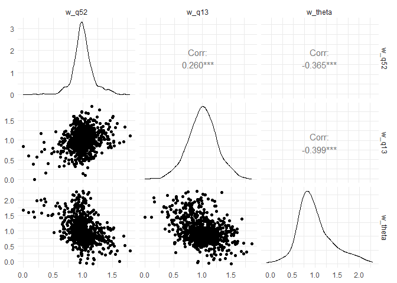

<!-- README.md is generated from README.Rmd. Please edit that file -->

# hpcalibrater

<!-- badges: start -->

<!-- badges: end -->

hpcalibrater creates a micro-calibrated ABM model for heat pump uptake
by Irish households.

## Installation

You can install the development version of hpcalibrater like so:

``` r
# install_github()
```

## Example

Survey data for 804 owner-occupiers with 39 features plus HH ID and
stated likelihood-to-adopt.

``` r
library(hpcalibrater)
library(tidyverse)
## basic example code
hp_survey_oo %>% dim()
#> [1] 804  41
```

Survey questions and answers are in:

``` r
hp_questions %>% head()
#> # A tibble: 6 × 2
#>   question        question_code
#>   <chr>           <chr>        
#> 1 Gender          qa           
#> 2 Age             qb           
#> 3 Region          qc2          
#> 4 Social Grade    qd           
#> 5 Work status     qe           
#> 6 Education level qf
```

Futher feature selection before passing to xgboost for model
micro-calibration

``` r
## basic example code
feature_select(hp_survey_oo) %>% dim()
#> [1] 804  32
```

Run GBM

``` r
bst <- get_boosted_tree_model(transform_to_utils(feature_select(hp_survey_oo,recode_bills=T,n_bill=5),epsilon=0.7))
shap_scores_long <- get_shap_scores(transform_to_utils(feature_select(hp_survey_oo,recode_bills=T,n_bill=5),epsilon=0.7),bst)
```

Extract partial utilities from shap_scores_long based on financial
feature (heating bills), social feature ()

``` r
get_empirical_partial_utilities(shap_scores_long)
#> Joining with `by = join_by(question_code)`
#> Joining with `by = join_by(question_code, response_code)`
#> # A tibble: 11 × 3
#> # Groups:   question_code [3]
#>    question_code response_code du_average
#>    <chr>                 <dbl>      <dbl>
#>  1 q13                       1    0.00352
#>  2 q13                       2    0.00329
#>  3 q13                       3    0.00281
#>  4 q13                       4    0.00328
#>  5 q13                       5    0.00617
#>  6 q13                       6    0.00638
#>  7 q52                       1    0.00550
#>  8 q52                       2    0.00351
#>  9 q52                       3    0.0123 
#> 10 q52                       4    0.0138 
#> 11 theta                    NA   -0.0913
```

``` r
weights <- get_model_weights(shap_scores_long,regularisation=1)
#> Joining with `by = join_by(question_code)`
#> Joining with `by = join_by(question_code, response_code)`
```

Pairs plot

``` r
library(GGally)
weights[,-1] %>% ggpairs() + theme_minimal()
```


