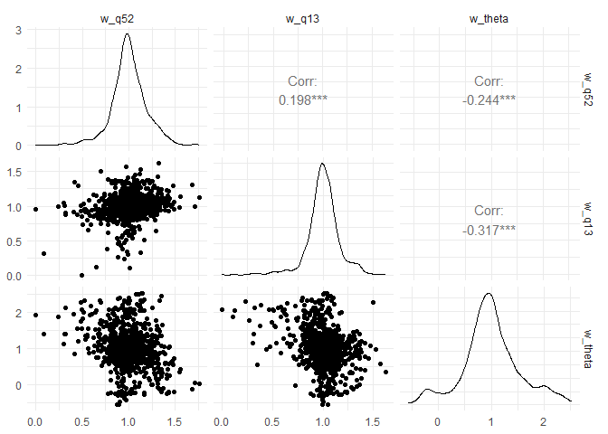

<!-- README.md is generated from README.Rmd. Please edit that file -->

# hpcalibrater

<!-- badges: start -->

<!-- badges: end -->

hpcalibrater creates a micro-calibrated ABM model for heat pump uptake
by Irish households.

## Installation

You can install the development version of hpcalibrater like so:

``` r
# install_github()
```

## Example

Survey data for 804 owner-occupiers with 39 features plus HH ID and
stated likelihood-to-adopt.

``` r
library(hpcalibrater)
library(tidyverse)
## basic example code
hp_survey_oo_calibrate %>% dim()
#> [1] 861  37
```

Survey questions and answers are in:

``` r
hp_questions_calibrate %>% head()
#> # A tibble: 6 × 2
#>   question_code question       
#>   <chr>         <chr>          
#> 1 serial        Serial         
#> 2 qa            Gender         
#> 3 qb            Age            
#> 4 qc2           Region         
#> 5 qe            Work status    
#> 6 qf            Education level
```

The dataset hp_survey_oo Further feature selection before passing to
xgboost for model micro-calibration

``` r
## basic example code
feature_select(hp_survey_oo_calibrate) %>% dim()
#> [1] 861  37
```

### Run GBM

The function `hpcalibrater::get_boosted_tree_model` generated a boosted
tree object using XGBoost. SHAP scores are extracted from this object
using `hpcalibrater::get_shap_scores`.

``` r
bst <- get_boosted_tree_model(transform_to_utils(feature_select(hp_survey_oo_calibrate,recode_bills=T,n_bill=5),epsilon=0.7))
shap_scores_long <- get_shap_scores(transform_to_utils(feature_select(hp_survey_oo_calibrate,recode_bills=T,n_bill=5),epsilon=0.7),bst)
```

### Micro-calibrated ABM

Partial utilities from `shap_scores_long` based on financial feature
(heating bills, **q13**), social feature (**q52**)

``` r
get_empirical_partial_utilities(shap_scores_long)
#> Joining with `by = join_by(question_code)`
#> Joining with `by = join_by(question_code, response_code)`
#> # A tibble: 11 × 3
#> # Groups:   question_code [3]
#>    question_code response_code du_average
#>    <chr>                 <dbl>      <dbl>
#>  1 q13                       1    0.00565
#>  2 q13                       2    0.00657
#>  3 q13                       3    0.00755
#>  4 q13                       4    0.00799
#>  5 q13                       5    0.0116 
#>  6 q13                       6    0.0117 
#>  7 q52                       1    0.00345
#>  8 q52                       2    0.00254
#>  9 q52                       3    0.00643
#> 10 q52                       4    0.00827
#> 11 theta                    NA   -0.0907
```

``` r
weights <- get_model_weights(shap_scores_long,regularisation=1)
#> Joining with `by = join_by(question_code)`
#> Joining with `by = join_by(question_code, response_code)`
```

### Pairs plot

``` r
library(GGally)
weights[,-1] %>% ggpairs() + theme_minimal()
```

 Note that
there is a significant skew in the barrier weights ($`\theta`$)
